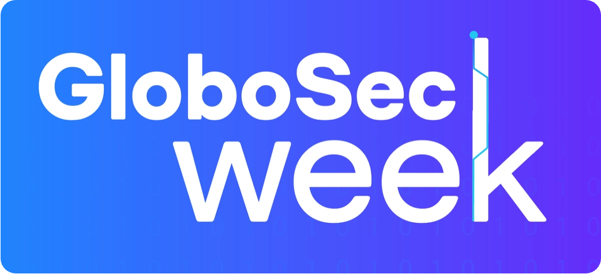

  

Edição 2025.

# [GloboSec Week] Links:

## 📆 Eventos de Tecnologia e SegInfo

- [**50 principais eventos de Tecnologia no mundo (2026)**](https://www.linkedin.com/pulse/eventos-de-tecnologia-e-seguran%C3%A7a-2026-eduardo-fedorowicz-pmouf/)
- [Mapa Interativo com diversos eventos de Segurança no Brasil e no mundo](https://infosecmap.com/explore-map/?type=event&search_location=Visible%20map%20area&lat=-15.91675&lng=-43.87506&proximity=2411.68&sort=order-by-date)

---

## 🧠  Guias de Estudo e referências

- [Iniciando em Segurança da Informação](https://meninadecybersec.notion.site/Iniciando-em-Seguran-a-da-Informa-o-cfe02d5ac2b74576b315083387894890) 
  - Repositório de Cursos, Certificações e outras coletâneas de links úteis para quem está iniciando
  - Autora: Sabrina Ramos (@meninadecybersec)

- [30 Days of Cybersecurity](https://www.notion.so/meninadecybersec/30-Days-of-Cybersecurity-c1f95dacd0cd4d09b4f80f526533243b)
  - Guia de estudos para iniciantes com 30 dias de desafios, atividades e materiais preparatórios para atuar no mercado de Cibersegurança
  - Autora: Sabrina Ramos (@meninadecybersec)

- #### Desenvolvimento Seguro de Aplicações:
  - [**GitHub - globocom/secDevLabs: Um laboratório de aprendizado sobre desenvolvimento seguro**](https://github.com/globocom/secDevLabs)
  - [OWASP Top Ten](https://owasp.org/www-project-top-ten/)
  - [OWASP Application Security Verification Standard (ASVS)](https://owasp.org/www-project-application-security-verification-standard/)
  - [Introduction - OWASP Cheat Sheet Series](https://cheatsheetseries.owasp.org/)

        
        

- #### Plataformas de Estudo

  - [Let's Defend](https://letsdefend.io)
    - Simulação de incidentes, playbooks e cursos voltados para cibersegurança.
    - Foco: **Cibersegurança Defensiva (Blue Team)**

  - [TryHackMe](https://tryhackme.com)
    - Laboratórios práticos sobre hacking ético e defesa. 
    - Foco: **Cibersegurança Ofensiva (Red Team)**

---

## 🏅 Certificações em Segurança 

- [**Security Certification Roadmap**](https://pauljerimy.com/security-certification-roadmap/)
  - Quadro geral de certificações em Segurança, custos e links com mais informações
  - Autor: Paul Jerimy

- ####  Certificações Relevantes (com chances de voucher gratuito)

  - [☁️ Azure Fundamentals (AZ-900)](https://learn.microsoft.com/pt-br/credentials/certifications/azure-fundamentals/?practice-assessment-type=certification)
  - [🔐 Security, Compliance and Identity (SC-900)](https://learn.microsoft.com/pt-br/credentials/certifications/security-compliance-and-identity-fundamentals/?practice-assessment-type=certification)
  - [🛡️ CompTIA Security+](https://www.comptia.org/en/certifications/security)
  - [🛡️ CompTIA A+](https://www.comptia.org/en/certifications/a/)
